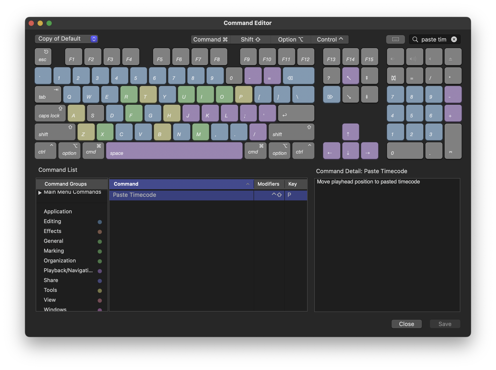
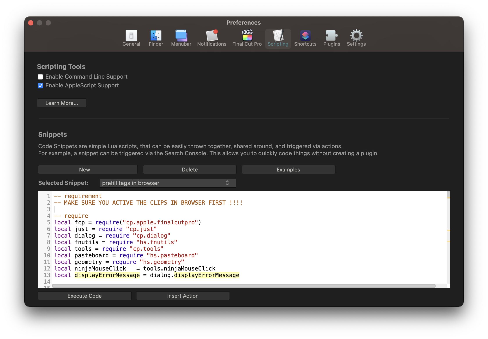
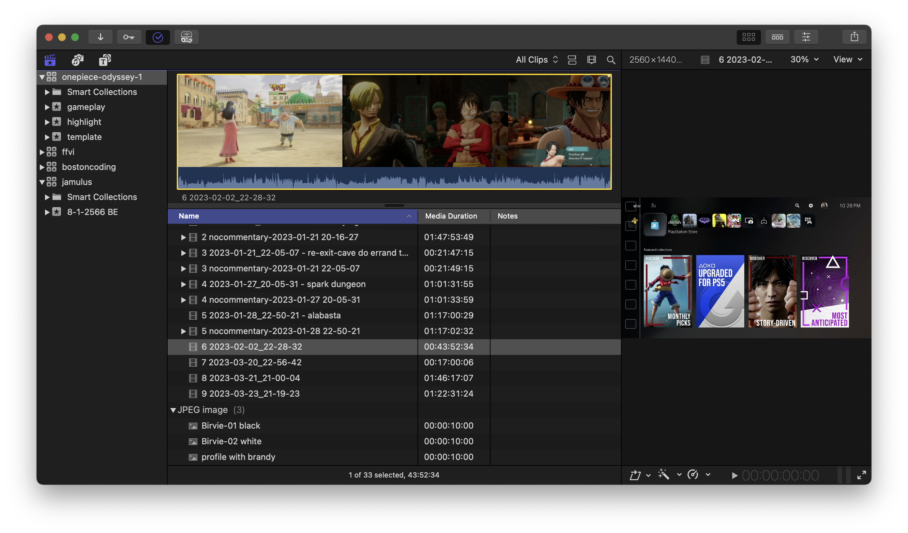
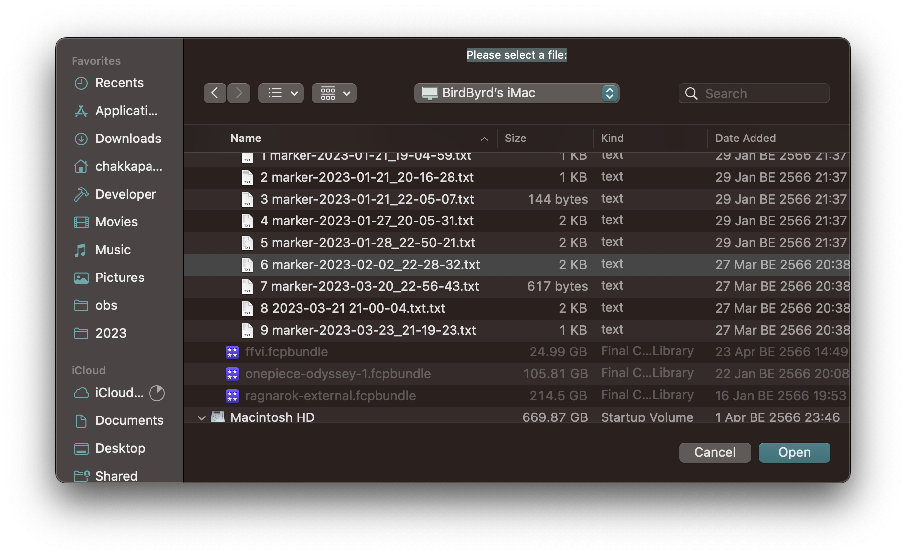

### Would like to support ? ###

[Buy me some beer ! 🍺🍺🍺🍺🍺🍺🍺🍺🍺🍺🍺🍺](https://bmc.link/bostoncoding)


# What is the output of this script ?

- Ask for input file which contain timestamp & text

```txt
elapsed time: 00:02:16    text: Start voice comment
elapsed time: 00:03:28    text: Chuck Norris join the channel

```

- Then automatically create markers on the selected file in `Final Cut Pro` browser.


https://github.com/bostoncoding-thailand/commandpost.io/assets/133562745/9095ae61-6cc8-4f49-92ae-d5af1c0f287e


# Pre Requisite

`PasteTimecode` shortcut in Final Cut Pro must be configured.



# Installation

Copy and paste this script into CommandPost Script



# How to use

- Make sure you have selected a file in Final Cut Pro browser



- Execute the script which it will ask for the input file.



- Wait until it finish the process. (Please don't move around the mouse cursor at this moment)
